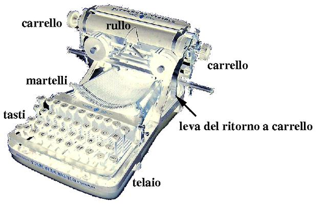
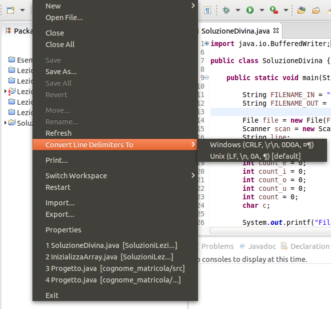
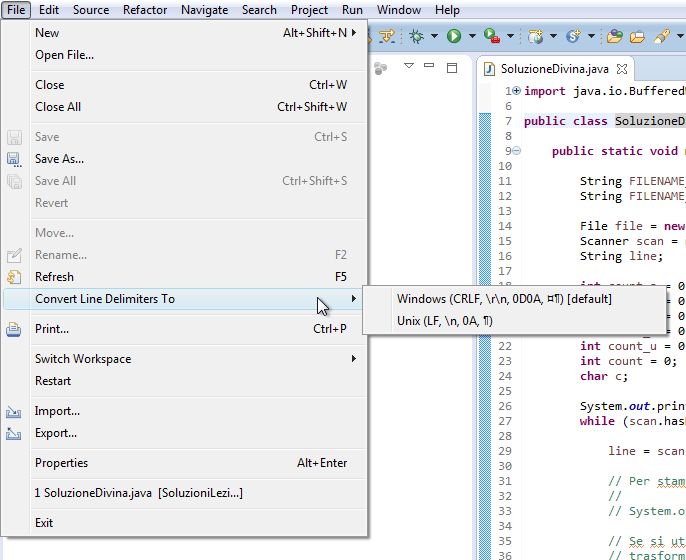
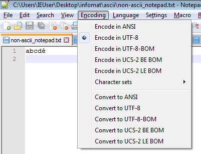
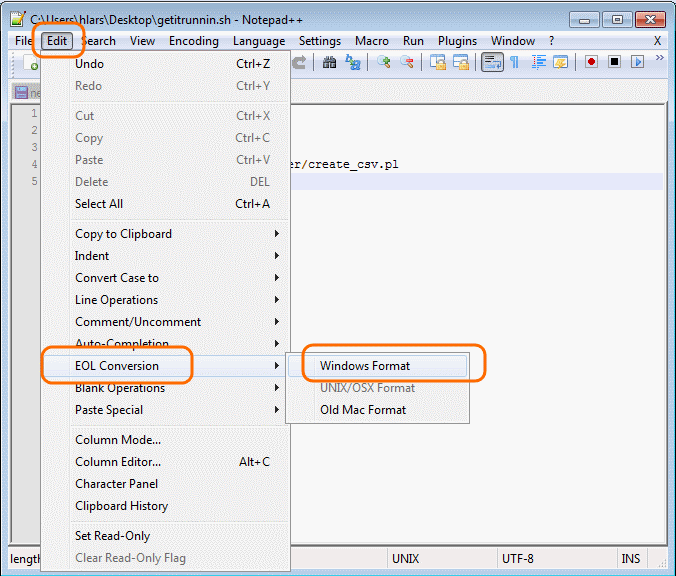

Ho ricevuto una domanda relativa alle dimensione dei file (in particolare
[`divina.txt`](../labinfo-mat_2015-2016/esercizi/divina.txt) che costituiva l'input
per un esercizio assegnato nella Lezione 04).

Approfitto della domanda per spiegare alcuni concetti di base legati all'_encoding_
di un file di testo. Infine, chiarisco alcuni punti riguardanti i caratteri
_"terminatori di linea"_ (caratteri "a capo", o end-of-line (EOL)) su sistemi
[Unix-like](https://it.wikipedia.org/wiki/Unix-like), anche detti sistemi _*nix_,
come le distribuzioni Linux e Mac OS X e i sistemi DOS/Windows.

## Come si calcola la dimensione di un testo in Java?

La risposta in realtà è "dipende". Ciò è dovuto al fatto che si può intendere
la "dimensione di un (file di) testo" in modi diversi.

### 1. Dimensione di un file di testo come numero di bytes

In Java, l'oggetto `File` possiede il metodo `File.lenght()` che ritorna la
lunghezza in byte del file da esso rappresentato. Questa è la stessa dimensione
che compare anche nel filesystem (per esempio controllando con il tasto destro
le "Proprietà" del file). 

Utilizzando il terminale (o _linea di comando_), possiamo ottenere le stesse
informazioni rispetto ai file contenuti nelle [soluzioni agli esercizi della lezione 04](http://disi.unitn.it/~consonni/teaching/labinfo-mat_2015-2016/soluzioni/Lezione04.zip).

* (Sistemi *nix): **comando `ls -l`**


$ ls -l
total 64
drwxrwxr-x 2 cristian cristian 4096 nov  8 19:24 bin
-rw-rw-r-- 1 cristian cristian 5065 nov  8 19:48 divina.txt
-rw-rw-r-- 1 cristian cristian 5201 dic  9 23:40 divina_win.txt
-rw-rw-r-- 1 cristian cristian   74 nov  8 19:40 esercizio01.txt
-rw-rw-r-- 1 cristian cristian   20 dic  9 23:40 risultati.txt
drwxrwxr-x 2 cristian cristian 4096 nov  8 19:24 src



La quarta colonna riporta la lunghezza dei file in bytes, per
`divina.txt` sono 5065 bytes. Notate che le cartelle `bin` e `src` occupano
ciascuna 4096 bytes (4 KB).

* (DOS/Windows): **comando `dir`**

<pre>
C:\Users\cristian\infomat\SoluzioniLezione04> dir

    Directory: C:\Users\IEUser\Desktop\infomat\SoluzioniLezione04

Mode                LastWriteTime     Length Name
----                -------------     ------ ----
d----         11/8/2015   7:58 PM            bin
d----         11/8/2015   7:58 PM            src
-----         11/8/2015   7:58 PM        295 .classpath
-----         11/8/2015   7:58 PM        377 .project
-----         11/8/2015   7:58 PM       5065 divina.txt
-----         11/8/2015   7:58 PM       5201 divina_win.txt
-----         11/8/2015   7:58 PM         74 esercizio01.txt
-----         11/8/2015   7:58 PM         55 risultati.txt 
</pre>

La terza colonna riporta la lunghezza del file (in bytes), anche in questo caso
`divina.txt` è un file lungo 5065 bytes.

### 2. Dimensione di un file di testo come numero di caratteri

Lo scopo dell'esercizio assegnato durante la lezione 4 era contare il numero di
vocali presenti in `divina.txt`: ho modificato la soluzione
(file `SoluzioneDivina.java`) per contare il numero di caratteri totali.
Eseguendo il programma si ottiene:
<pre>
File length: 5201.

== Statistiche ==
num. a: 422.
num. e: 429.
num. i: 386.
num. o: 323.
num. u: 150.
totale vocali: 1710.
totale caratteri: 4849.

</pre>

Il numero totale di caratteri (esclusi gli "a capo") è quindi 4849.

## Caratteri non ASCII e encoding

Come detto a lezione, per salvare un file di testo su disco è necessario
procedere alla sua "traduzione" (o _encoding_) in una data
[codifica di caratteri](https://it.wikipedia.org/wiki/Codifica_di_caratteri)
(o _charset_).

### ASCII

Storicamente, il primo sistema di codifica di caratteri è stato il
[codice Morse](https://it.wikipedia.org/wiki/Codice_Morse) inventato nel
1837 per trasmettere messaggi via telegrafo.

Nel codice morse ogni carattere viene rappresentato con una sequenza di simboli
che possono essere: punto (•), linea (—), intervallo breve (tra ogni lettera),
intervallo medio (tra parole) e intervallo lungo (tra frasi).

In questo modo, si può usare una [tabella di conversione](https://it.wikipedia.org/wiki/Codice_Morse#Tabelle_dei_codici)
e "tradurre" ogni lettera in una data sequenza. Per esempio, la lettera `S` viene
codificata da tre punti consecutivi (separati da spazi brevi): `• • •` e la
lettera `O` viene tradotta da tre linee consecutive: `— — —`.
Quindi il famoso messaggio di aiuto "SOS" si traduce con la sequenza (molto
facile da ricordare): "tre punti, tre linee, tre punti": `• • • — — — • • •`.

In ambito informatico, negli anni '60 del XX secolo, viene ideato il codice
**ASCII** (acronimo di _American Standard Code for Information Interchange_,
Codice Standard Americano per lo Scambio di Informazioni).

L'ASCII è un codice a 7 bit che associa un carattere (una lettera, un numero,
un segno di punteggiatura) ad ogni numero decimale tra 0 e 127 (ovvero tra
i numeri binari `0000000` e `1111111`). Quindi per esempio il carattere " "
(spazio) è rappresentato dal numero 32, la lettera "A" dal numero 65, la lettera
"a" dal numero 97. 

Qui di seguito è presentata una tabella compatta della conversione tra codice
ASCII (in valori decimali) e lettere da 30 (RS, record separator) a 127 (DEL).
I valori minori di 30 sono utilizzati per inviare codici speciali come per
esempio il codice 7 (BEL) che produce un suono, o l'11 per la tabulazione
(`\t`).
<pre>

  30 40 50 60 70 80 90 100 110 120
 ---------------------------------
0: RS (  2  <  F  P  Z  d   n   x
1: US )  3  =  G  Q  [  e   o   y
2:    *  4  >  H  R  \  f   p   z
3: !  +  5  ?  I  S  ]  g   q   {
4: "  ,  6  @  J  T  ^  h   r   |
5: #  -  7  A  K  U  _  i   s   }
6: $  .  8  B  L  V  `  j   t   ~
7: %  /  9  C  M  W  a  k   u  DEL
8: &  0  :  D  N  X  b  l   v
9: ´  1  ;  E  O  Y  c  m   w
--
From the Linux man page: man ascii
</pre>

Essendo un codice a 7 bit, ogni carattere del codice ASCII poteva essere salvato
in un byte (8 bit) che è l'unità di base gestita dai processori dei computer
dell'epoca (e attuali), inoltre la maggioranza delle codifiche contengono
l'ASCII come sottoinsieme nei primi 7 bit[^1].

Possiamo crare un file di testo (con un programma come
[GEdit](https://wiki.gnome.org/Apps/Gedit) su Linux,
[TextEdit](https://support.apple.com/it-it/HT2523) su Mac o
[Notepad](http://windows.microsoft.com/it-it/windows/open-notepad#1TC=windows-7) su Windows)
e salvarlo come [`ascii.txt`](../labinfo-mat_2015-2016/esercizi/ascii.txt) con il contenuto seguente:
<pre>
abcd↵
</pre>
(il simbolo ↵ indica "invio").

Salvando il file, avrà una dimensione di 6 bytes (su sistemi DOS/Windows) o 5
bytes (su sistemi *nix). 

Il file verrà salvato e codificato usando la _codifica predefinita di sistema_,
che dipende dalle impostazioni della lingua (_locale_, in inglese)[^2].
Su sistemi che usano lingue occidentali la codifica è solitamente l'[ISO-8859-1](https://it.wikipedia.org/wiki/ISO/IEC_8859-1)
oppure [UTF-8](https://it.wikipedia.org/wiki/UTF-8), allora ogni carattere ha esattamente
la dimensione di un byte, quindi _in questo caso_ la dimensione del file in
bytes equivarrà al numero di caratteri.

Tutti i caratteri sono codificabili in ASCII, quindi la dimensione è data da un byte
per ciascuna lettera e 2 bytes (su Windows) o 1 byte (su *nix) per il terminatore
di riga (il carattere di "a capo").la spiegazione di questa differenza è il tema
della prossima sezione.

### Oltre ASCII

Se si usano caratteri non-ASCII questa equivalenza non è più vera.
In generale, possiamo dire che per rappresentare caratteri non-ASCII è necessario
più di un byte.

Per esempio creiamo un file chiamato [`non-ascii.txt`](../labinfo-mat_2015-2016/esercizi/non-ascii.txt)
con il seguente contenuto:
<pre>
abcdè↵
</pre>

Salvando il file, avrà una dimensione di 7 bytes (su sistemi DOS/Windows) o 8
bytes (su sistemi *nix). Quindi l'encoding utilizzato per rappresentare il carattere 
_"e con accento grave"_ sono necessari 2 bytes. 

Quindi, quando si hanno caratteri non ASCII la dimensione in byte ***non equivale
necessariamente al numero di caratteri***.

Le difficoltà legate alla gestione dei file di testo sono dovute al fatto che
non è possibile conoscere a priori, ovvero senza leggere il file, qual è l'encoding
utilizzato per rappresentare i caratteri. A questo si aggiunge il fatto che nella
rappresentazione dell'ASCII a 8 bit di fatto è rimasto libero un bit (pari a 128
combinazioni aggiuntive possibili) che è stato utilizzato negli anni nei modi più
svariati creando decine di encoding diversi (e incompatibili tra loro).

Gli encoding esistenti sono moltissimi: una [lista](https://www.iana.org/assignments/character-sets/character-sets.xhtml)
è disponibile sul sito della IANA, mentre su Wikipedia la lista di quelli che
sono indicati come "[encoding _più comuni_](https://en.wikipedia.org/w/index.php?title=Character_encoding&oldid=691515362#Common_character_encodings)"
sono oltre 60.

Questa situazione ha, storicamente, creato molte difficoltà ai programmatori e svariati
problemi per l'[internazionalizzazione e la localizzazione](https://en.wikipedia.org/wiki/Internationalization_and_localization)
dei software[^3]. Questa situazione creava problemi anche per lo scambio di file:
un file creato su un sistema con un dato encoding, passato su un altro sistema veniva
decodificato in maniera errata. Per esempio[^4], su alcuni PC il codice carattere 130
veniva visualizzato come `é`, ma sui computer venduti in Israele veniva visualizzato
come la lettera dell'alfabeto ebraico Gimel (`ג`), e quindi la parola `résumé`
scritta in un documento con un _locale_ impostato all'inglese americano veniva
visualizzata come `rגsumג`. 
Per altre lingue, come per esempio il russo, erano (e sono tuttora) disponibili
svariati encoding diversi e quindi non era possibile scambiarsi documenti in russo
in modo affidabile.

Tutti questi encoding[^5], che facevano uso delle combinazioni date dall'ottavo bit
(quindi i numeri da 128 a 255), furono riuniti in uno
[standard ANSI noto come ISO 8859-1](https://en.wikipedia.org/wiki/ISO/IEC_8859-1)
nel 1985. In questo standard tutti i codici inferiori a 128 erano identici (e 
coincidevano sostanzialmente con l'ASCII) mentre venivano descritti i diversi modi
per gestire i codici superiori a 128, che dipendevano dall'impostazione del _locale_
del sistema. Questi diversi sistemi sono stati chiamati "[code pages](https://en.wikipedia.org/wiki/Code_page)".
Per esempio, in Israele i sistemi DOS usavano la code page numero 862, mentre
per il greco si usava la code page 737[^6].

Il problema divenne ingestibile quando con l'arrivo di internet divenne molto
semplice scambiarsi file che erano stati scritti su sistemi che usavano encoding
diversi. 

Per questo motivo fu inventato l'encoding  _Unicode_, che ***non è un encoding***
di per sè, ma un sistema di rappresentare i caratteri. In Unicode, ogni carattere
viene rappresentato da un numero detto _code point_ che a sua volta può essere
codificato con encoding diversi. 

Un _carattere unicode_ è rappresentato come un numero preceduto da "U+" pertanto
la lettera Ḁ è il _code point_ U+1E00 e rappresenta la
"[Lettera latina maiuscola A con un anello sottostante](http://unicode.org/charts/PDF/U1E00.pdf)".

In particolare, Unicode può essere codificato in [UTF-8](https://it.wikipedia.org/wiki/UTF-8)
(Unicode Transformation Format, 8 bit). UTF-8 è un encoding a lunghezza variabile
(_variable length encoding_) per cui alcuni caratteri sono rappresentati usando un
singolo byte, altri ne utilizzano due (o più, fino a 4). UTF-8 si è diffuso moltissimo
negli ultimi anni ed è [ampiamente utilizzato nel Web](https://commons.wikimedia.org/wiki/File:UnicodeGrow2b.png). 

Riprendendo l'esempio precendemte, la lettera Ḁ, ovvero _code point_ U+1E00,
viene codificata in UTF-8 con la sequenza di tre bit `11100001 10111000 10000000`.

Chi volesse ulteriori informazioni su Unicode, così come chiunque abbia in mente
di scrivere un programma che gestisce stringhe di testo è invitato a leggere i
due post linkati nella prossima sezione.

### In conclusione (per quanto riguarda l'encoding)

Possiamo fare alcuni calcoli relativi al file [`divina.txt`](../labinfo-mat_2015-2016/esercizi/divina.txt):

* è possibile convertire il contenuto nel file in soli caratteri ASCII.
Questo vuol dire, per esempio, convertire il carattere `è → e`, `à → a`,
ecc.. Questo processo si chiama [_traslitterazione_](https://it.wikipedia.org/wiki/Traslitterazione).
sBisogna fare attenzione al fatto che alcuni caratteri come le virgolette basse
(ovvero `«` e `»`) vengono convertiti in due caratteri ovvero `« → <<` e
`» → >>`.

* Se alla dimensione del file convertito in ASCII (5001 byte) si sottrae
il numero di righe (136) e si tiene conto del fatto che ci sono 8
caratteri `«` e altrettanti `»` che sono convertiti in due caratteri si ottiene:
$$5001 - 136 - 8 - 8 = 4849$$
che è esattamente lo stesso conteggio che si ottiene contando i singoli
caratteri (esclusi i caratteri da a capo).

In conclusione, ***non ha senso gestire una stringa senza conoscere l'encoding che
sta utilizzando***. Qualsiasi editor di testo moderno e non minimale dovrebbe
permettervi di scegliere qual è l'encoding da utilizzare per salvare il vostro file
di testo. UTF-8 è una buona scelta.

Per chi volesse approfondire l'argomento consiglio di leggere questi due post,
in inglese:

* ["The Absolute Minimum Every Software Developer Absolutely, Positively Must Know About Unicode and Character Sets (No Excuses!)](http://www.joelonsoftware.com/articles/Unicode.html) di Joel Spolsky, uno dei fondatori del sito di domande &
risposte [Stack Overflow](https://stackoverflow.com/).

* ["What every programmer absolutely, positively needs to know about encodings and character sets to work with text"](http://kunststube.net/encoding/)
di David C. Zentgraf.

# Caratteri terminatori di linea (o "a capo")

Rimane da risolvere un problema: come mai salvando lo "stesso" file creato con
GEdit o con Notepad ha delle dimensioni diverse (per esempio 5 o 6 bytes nel
caso del file `ascii.txt`):

$ ls -l

-rw-rw-r-- 1 cristian cristian    5 dic 14 11:50 ascii.txt
-rw-rw-r-- 1 cristian cristian    6 dic 14 11:49 ascii_win.txt
-rw-rw-r-- 1 cristian cristian    7 dic 14 13:08 non-ascii.txt
-rw-rw-r-- 1 cristian cristian    8 dic 14 13:07 non-ascii_win.txt



Un punto che vale la pena chiarire immediatamente è che la differenza ***non è dovuta
all'encoding***. entrambi i file sono salvati con encoding UTF-8.

La differenza sta nel carattere di "[a capo](https://it.wikipedia.org/wiki/Ritorno_a_capo)"
(_newline_, _line break_, in inglese, oppure _carattere end-of-line_ / _EOL_).

Il carattere di ritorno a capo è un carattere speciale usato per gestire la fine
di una riga di testo (e quindi non un vero e proprio carattere visibile sullo
schermo).

Piattaforme hardware e sistemi operativi diversi possono rappresentare il carattere di
ritorno a capo in modi diversi. Come abbiamo visto per l'encoding, questo
costituisce un problema quando è necessario lo scambio di dati tra sistemi che
usano rappresentazioni differenti.

Nell'ASCII esistono due caratteri che possono essere usati (da soli o in
combinazione), per rappresentare il ritorno a capo:

* il carattere numero 10 detto LF (_line feed_) o anche `\n` (_new line_)

* il carattere numero 13 detto CR (_carriage return_) o anche `\r`

Questi due caratteri indicano rispettivamente una "nuova linea" e il "ritorno del carrello".
Per chi di voi abbia mai utilizzato una macchina da scrivere questi due caratteri
corrispondevano a due operazioni diverse (solitamente consecutive) fatte sulla "leva del ritorno a carrello":
spingendo la leva si faceva girare il rullo che alzava il foglio, rendendo 
disponibile una nuova riga (_line feed_), al termine della corsa della leva si
continuava a spingere sulla stessa per fare tornare il carrello alla
posizione iniziale (_carriage return_).

<table class="image">
<tr><td style="text-align:center"></td></tr>
<caption align="bottom">Immagine tratta da <a href="http://wwwcdf.pd.infn.it/AppuntiLinux/220.jpg">INFN - sezione di Padova</a></caption>
</table>

Esistono quindi tre modi per indicare una terminazione di linea:

* LF (`\n`): usata da sistemi Unix e sistemi Unix-like (GNU/Linux e Mac OS X, tra gli altri);

* CR+LF (`\r\n`): usata da MS-DOS e Microsoft Windows;

* CR (`\r`): Macchine Commodore, famiglia Apple (Mac OS fino alla versione 9 inclusa
e per questo anche noto come EOL "Mac classico")

Pertanto il contenuto del file [`ascii.txt`](../labinfo-mat_2015-2016/esercizi/ascii.txt)
è più precisamente il seguente:
<pre>
abcd\n
</pre>

Invece, lo stesso file creato con gli EOL Windows ([`ascii_win.txt`](../labinfo-mat_2015-2016/esercizi/ascii_win.txt))
avrebbe il seguente contenuto:
<pre>
abcd\r\n
</pre>

Possiamo visualizzare anche con i [seguenti comandi da terminale](https://stackoverflow.com/questions/23214513/how-can-i-list-unique-characters-used-in-a-text-file-using-linux-command-line-to) che elencano i caratteri presenti rispettivamente in
`ascii.txt` e `ascii_win.txt`:

$ cat ascii.txt | od -cv -An                                                                                                                                 
   a   b   c   d  \n

$ cat ascii_win.txt | od -cv -An
   a   b   c   d  \r  \n



Dato che entrambi i file sono salvati con la codifica UTF-8 e constano solo di
caratteri ASCII ogni carattere può essere codificato in un byte e quindi le dimensioni
dei due file sono rispettivamente 5 bytes per `ascii.txt` e 6 bytes per `ascii_win.txt`

Un modo per distinguere tra le due tipologie di terminatori è usare il comando
`file` disponibile sulle distribuzioni Unix e anche su Windows (come installare
questi strumenti utili sarà oggetto di un altro post). Il comando `file` cerca
di inferire alcune informazioni rispetto al file specificato come argomento:


$ file ascii.txt
ascii.txt: ASCII text

$ file ascii_win.txt
ascii_win.txt: ASCII text, with CRLF line terminators


Come si può vedere nel caso di `ascii_win.txt` viene indicato che il file usa i
terminatori `CR+LF`.

## Convertire da terminatori di linea *nix a DOS/Windows

Esistono diversi modi per convertire i terminatori di linea dal formato *nix a
quello DOS/Windows e viceversa.

### Eclipse

Innanzitutto in Eclipse è possibile
[cambiare i terminatori di linea](https://stackoverflow.com/questions/2374728/eclipse-editor-how-to-change-file-format-from-dos-to-unix) 
per il file corrente dal menu `File > Convert Line Delimiters To`[^8].

<table class="image">
<tr>
	<td style="text-align:center"></td>
	<td style="text-align:center"></td>
</tr>
<caption align="bottom">Cambiare i terminatori di riga con Eclipse su Linux e Windows (cliccare sulle immagini per ingrandirle)</caption>
</table>

### Altri editor di testo

In generare gli editor di testo moderni, come per esempio GEdit su Linux,
TextEdit su Mac o [Notepad++](https://notepad-plus-plus.org/) su Windows
permettono di gestire sia l'encoding da utilizzare che i terminatori di riga.

<table class="image">
<tr>
<td style="text-align:center"></td>
</tr>
<caption align="bottom">Quando si salva un file è possibile selezionare l'encoding e cambiare i terminatori di riga con GEdit su Linux (cliccare sull'immagine per ingrandirla)</caption>
</table>

<table class="image">
<tr>
	<td style="text-align:center"></td>
	<td style="text-align:center"></td>
</tr>
<caption align="bottom">Selezionare l'encoding e cambiare i terminatori di riga con Notepad++ su Windows (<a href="http://www.larshaendler.com/2013/06/10/notepad-unix-to-dos-line-endings/">fonte</a>) (cliccare sulle immagini per ingrandirle)</caption>
</table>

<table class="image">
<tr>
	<td style="text-align:center"></td>
</tr>
<caption align="bottom">Selezionare l'encoding con TextEdit su Mac OS X (cliccare sull'immagine per ingrandirla)</caption>
</table>

### Strumenti da linea di comando per convertire i terminatori di linea da Linux/Mac OS X a DOS/Windows (e viceversa)

Esistono svariati programmi per convertire i terminatori di riga tra i vari
formati: da Linux o Mac OS X a DOS/Windows o "Mac classico":

* [dos2unix/unix2dos](http://waterlan.home.xs4all.nl/dos2unix.html) è un
programma disponibile con una licenza libera e installabile su Linux, Mac e Windows.
Un esempio di conversione dal formato *nix a DOS/Windows è il seguente:


$ unix2dos -n ascii.txt ascii_convertito_win.txt
unix2dos: converting file ascii.txt to file ascii_convertito_win.txt in DOS format ...



* [tofrodos](http://www.thefreecountry.com/tofrodos/), ovvero _todos_ e _fromdos_,
programma del tutto simile al precedente. Su Ubuntu è disponibile nel pacchetto
(installabile con `apt-get` o dal Software Center) `tofrodos`.

* [flip](https://ccrma.stanford.edu/~craig/utility/flip/), un altro programma che
converte tra i vari terminatori di riga. Anche in questo caso il codice sorgente
è disponibile.

Se incontrate qualche caso strano questa domanda su StackOverflow
[approfondisce le differenze tra i file di testo su *nix e su Windows](https://superuser.com/questions/294219/what-are-the-differences-between-linux-and-windows-txt-files-unicode-encoding) sia per quanto riguarda l'encoding che i terminatori di
riga.

## In conclusione

Per concludere, possiamo fare qualche conto relativo al file [`divina_win.txt`](../labinfo-mat_2015-2016/esercizi/divina_win.txt).


$ ls -l divina_win.txt
-rw-rw-r-- 1 cristian cristian 5201 dic 15 14:39 divina_win.txt


La dimensione del file è 5201 bytes. Il comando `file` ci dice che usa i
terminatori di linea in formato Windows:


$ file divina_win.txt
divina_win.txt: UTF-8 Unicode text, with CRLF line terminators


Possiamo usare il comando `wc` (_word count_)[^9] con l'opzione `-l` per contare
il numero di righe (ovver il numero di "a capo" del file):


$ wc -l divina_win.txt
136 divina_win.txt


Con un'altra combinazione di comandi possiamo [contare quanti sono i caratteri non-ASCII](https://stackoverflow.com/questions/3001177/how-do-i-grep-for-all-non-ascii-characters-in-unix) che compaiono in `divina_win.txt`:


grep -o -P "[\x80-\xFF]" divina_win.txt |               # filtra tutti i caratteri non-ASCII e li stampa su una riga ciascuno
awk '!/^$/{a[$0]++}END{for (i in a)print i,a[i];}' |    # conteggia le occorrenze di ogni carattere
awk '{sum+=$2} END {print sum}'                         # somma i conteggi

80


Quindi ci sono $$80$$ caratteri non-ASCII in `divina_win.txt`, in particolare sono i
seguenti:
<pre>
ò 7
ó 1
è 10
é 8
« 8
ì 9
ù 8
» 8
à 17
ï 4
</pre> 

Se ora sottraiamo dalla dimensione del file (5001), il numero di caratteri terminatori
di linea (ovvero il numero di linee per due) e i caratteri non-ASCII[^10] otteniamo:
$$5001 - 136 \cdot 2 - 80 = 4849$$.

Esattamente come nel caso precedente.

[^1]: Gli encoding che includono ASCII nei loro primi 8 bit vengono detti ASCII compatibili (_ASCII-compatible_).
[^2]: la codifica di sistema dipende dal sistema operativo che state utilizzando e dalle impostazioni della lingua. I sistemi *nix generalmente utilizzano UTF-8, mentre Windows [utilizza internamente UTF-16 low-endian](https://superuser.com/questions/294219/what-are-the-differences-between-linux-and-windows-txt-files-unicode-encoding).
[^3]: Con _internazionalizzazione_ si intende la traduzione dei messaggi di un programma (come per esempio le voci di menu) in un'altra lingua. La _localizzazione_ invece è il processo di adattamento di un software ad un contesto internazionale. Per esempio, l'internazionalizzazione consiste nel tradurre la voce di menu "Help" in "Aiuto" mentre la localizzazione è la possibilità di visualizzare, per esempio, delle lunghezze in metri invece che in iarde o piedi.
[^4]: Il paragrafo seguente è tratto da ["The Absolute Minimum Every Software Developer Absolutely, Positively Must Know About Unicode and Character Sets (No Excuses!)](http://www.joelonsoftware.com/articles/Unicode.html) di Joel Spolsky
[^5]: v. la nota 3.
[^6]: Questa risposta su Stack Overflow chiarisce [la differenza "encoding", "character set" e "code page"?](http://stackoverflow.com/a/3441690) (in inglese)
[^7]: Il paragrafo seguente è tratto dalla voce di Wikipedia "[Ritorno_a_capo](https://it.wikipedia.org/w/index.php?title=Ritorno_a_capo&oldid=62617013)", versione 62617013 del 22 novembre 2013.
[^8]: è possibile cambiare sia l'encoding di default che i terminatori da linea dal menu `Window > Preferences > General > Workspace`.
[^9]: anche questo comando è disponibili su sistemi Windows e in un prossimo post vedremo come installarlo.
[^10]: ovvero, in questo caso tutti i caratteri non-ASCII sono rappresentati con 2 bytes e quindi sono contati due volte. 